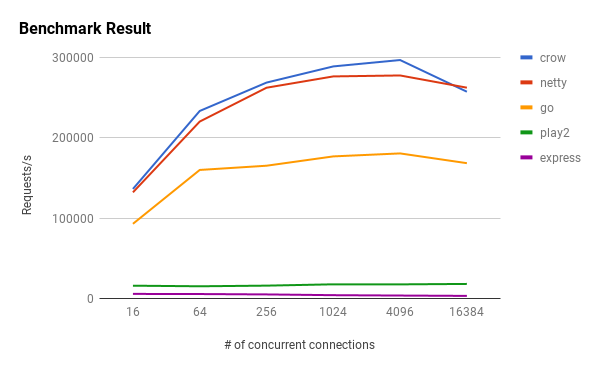

乌鸦是Web的C++微服务框架，支持mac,linux,windows,三大平台，开发速度最快最迅速最猛烈，下一步正打算支持数据库，以及ORM。

（灵感来自 Python Flask）[由Asciphx提供的分支]

[](https://travis-ci.org/ipkn/crow)
[](https://coveralls.io/r/ipkn/crow?branch=master)

```c++
#include "crow.h"
int main(){
    crow::SimpleApp app;
    CROW_ROUTE(app, "/")([](){
        return "Hello world";
    });
    app.port(18080).multithreaded().run();
}
```

## 特点
- 简易路由，类似于Python Flask
- 类型安全处理程序（参见示例），非常快
 
- 更多关于[crow benchmark]的数据(https://github.com/ipkn/crow-benchmark)
- 快速内置JSON解析器（crow:：JSON）
- 也可以使用[json11](https://github.com/dropbox/json11)或[rapidjson](https://github.com/miloyip/rapidjson)为了更好的速度或可读性
- [Mustache](http://mustache.github.io/)基于模板库（crow:：mustache）
- 仅页眉的每一项功能 [`crow_all.h`](https://github.com/ipkn/crow/releases/download/v0.1/crow_all.h) with every features ([Download from here](https://github.com/ipkn/crow/releases/download/v0.1/crow_all.h))
- 中间件支持，Websocket支持
- 支持静态资源,并且默认在'static/'目录
## 仍在开发中
-~~内置ORM~~
-检查[sqlpp11](https://github.com/rbock/sqlpp11)如果你想要的话。

## 示例

#### 服务端渲染
```c++
  CROW_ROUTE(app,"/")([] {
	char name[256];gethostname(name,256);
	mustache::Ctx x;x["servername"]=name;
	auto page=mustache::load("index.html");
	return page.render(x);
  });
```

#### JSON响应
```c++
CROW_ROUTE(app, "/json")([]{
    crow::json::wvalue x;
    x["message"] = "Hello, World!";
    return x;
});
```

#### 论据
```c++
CROW_ROUTE(app,"/hello/<int>")([](int count){
    if (count > 100) return crow::Res(400);
    std::ostringstream os;
    os << count << " bottles of beer!";
    return crow::Res(os.str());
});
```
编译时的处理程序参数类型检查 
```c++
// 编译错误，消息"处理程序类型与URL参数不匹配"
CROW_ROUTE(app,"/another/<int>")([](int a, int b){
    return crow::Res(500);
});
```

#### 处理JSON请求
```c++
CROW_ROUTE(app, "/add_json").methods("POST"_method)
([](const crow::Req& req){
    auto x = crow::json::load(req.body);
    if (!x)
        return crow::Res(400);
    int sum = x["a"].i()+x["b"].i();
    std::ostringstream os;
    os << sum;
    return crow::Res{os.str()};
});
```

## 如何构建
如果您只想使用crow，请复制amalgamate/crow_all.h 并包含它。

### 要求
- C++ 编译器，支持C++ 11（用G++测试>=4.8）
- 任何版本的boost库
- 构建示例的CMake
- 建议与tcmalloc/jemalloc链接以提高速度。
- 现在支持VS2019，功能有限（只有url的运行时检查可用。）

### 建筑（测试、示例）
建议使用CMake进行源代码外构建。
```
mkdir build
cd build
cmake ..
make
```

可以使用以下命令运行测试：

```
ctest
```

### 安装缺少的依赖项
#### Ubuntu
    sudo apt-get install build-essential libtcmalloc-minimal4 && sudo ln -s /usr/lib/libtcmalloc_minimal.so.4 /usr/lib/libtcmalloc_minimal.so
#### OSX
    brew install boost google-perftools

#### windows

>首次安装boost

>第二次修改CmakeLists.txt

##### CmakeLists.txt[示例]

```cmake
SET(BOOST_ROOT "E:/Code/boost_1_75_0") #Installation address of decompressed version
set(Boost_USE_STATIC_LIBS ON) #Support anything else
```

### 归属
Crow使用以下库。  
http解析器 https://github.com/nodejs/http-parser

http_parser.c 基于NGINX版权所有伊戈尔・西索耶夫的 src/http/ngx_http_parse.c 
其他更改的许可条款与NGINX和版权所有Joyent，Inc.和其他节点贡献者。版权所有。
兹免费准许任何人取得副本
本软件及相关文档文件（“软件”），以
不受限制地经营软件，包括但不限于
使用、复制、修改、合并、发布、分发、再许可和/或
销售软件的副本，并允许软件的使用者
按照以下条件提供：
上述版权声明和本许可声明应包含在
软件的所有副本或主要部分。
本软件按“原样”提供，不提供任何形式的明示或明示担保
默示，包括但不限于适销性保证，
适用于特定目的和非侵犯性。在任何情况下
作者或版权持有人对任何索赔、损害或其他
责任，无论是在合同诉讼、侵权诉讼或其他诉讼中产生的
来自、来自或与软件、使用或其他交易有关
在软件中。

qs_parse https://github.com/bartgrantham/qs_parse  
版权所有（c）2010 Bart Grantham
兹免费准许任何人取得副本
本软件及相关文档文件（“软件”），以处理
在软件中不受限制，包括但不限于权利
使用、复制、修改、合并、发布、分发、再许可和/或销售
软件的副本，并允许使用软件的人员
按照以下条件提供：
上述版权声明和本许可声明应包含在
软件的所有副本或主要部分。

TinySHA1 https://github.com/mohaps/TinySHA1

TinySHA1-SHA1算法的一个只包含报头的实现。基于boost::uuid::details中的实现
Cmohaps@gmail.com
特此授予出于任何目的使用、复制、修改和分发本软件的许可，无论是否收费，前提是上述版权声明和本许可声明出现在所有副本中。
本软件按“原样”提供，作者不承担与本软件有关的所有保证，包括对适销性和适用性的所有暗示保证。一